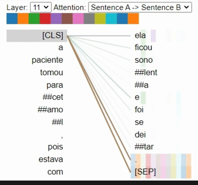

# BioBERTpt - Portuguese Clinical and Biomedical BERT

This repository contains fine-tuned [BERT](https://github.com/google-research/bert) models trained on the clinical domain for Portuguese language. Pre-trained BERT-multilingual-cased were fine-tuned with clinical narratives from Brazilian hospitals and abstracts of scientific papers from Pubmed and Scielo.

## Attention-head view

This is a example of the attention visualizing in the Transformer model with **BioBERTpt(all)**, using [BertViz](https://github.com/jessevig/bertviz). The attention-head view visualizes the attention patterns produced by one or more attention heads in a given transformer layer.



## NER Experiment in SemClinBr Corpora

We evaluate our models on [SemClinBr](https://github.com/HAILab-PUCPR/SemClinBr), a semantically annotated corpus for Portuguese clinical NER, containing 1,000 labeled clinical notes. These corpus comprehended 100 UMLS semantic types, summarized in 13 groups of entities: Disorders, Chemicals and Drugs, Medical Procedure, Diagnostic Procedure, Disease Or Syndrome, Findings, Health Care Activity, Laboratory or Test Result, Medical Device, Pharmacologic Substance, Quantitative Concept, Sign or Symptom and Therapeutic or Preventive Procedure.

The table below shows complete **F1-score** results for each entity in SemClinBr, where the last three models (in italian) are our in-domain models. In bold, the higher values. 

| Entity / Model | Disorders | ChemicalDrugs | Procedures | DiagProced | DiseaseSynd | Findings | Heatlh | Laboratory | Medical | Pharmacologic | Quantitative | Sign | Therapeutic |
|------|------|------|------|------|------|------|------|------|------|------|------|------|------|
|BERT multilingual uncased|0.7868|0.9026|0.6696|0.5462|0.5624|0.5034|0.3735|0.3778|0.5585|0.7557|**0.6068**|0.5185|0.4874|
|BERT multilingual cased|0.7823|0.9010|0.6744|0.5193|0.5380|0.5046|0.4123|0.4168|0.5927|0.5927|0.6129|0.5366|0.4862|
|Portuguese BERT large|0.6250|0.7823|0.4525|0.5043|0.5745|**0.5264**|0.3355|0.4041|0.5135|0.7225|0.5615|0.5517|0.4888|
|Portuguese BERT base|0.7844|0.9038|0.6721|0.5558|0.5399|0.500|0.3462|0.4223|0.5366|0.7754|0.5676|0.5375|0.4712|
|*BioBERtpt (bio)*|0.7853|0.8939|0.6893|0.5507|0.5749|0.5260|**0.4591**|0.3981|**0.6042**|0.7237|0.5919|0.5335|0.5008|
|*BioBERtpt (clin)*|0.7805|**0.9109**|0.6855|**0.5595**|**0.5829**|0.5207|0.4057|**0.4526**|0.5618|**0.7791**|0.5926|0.5435|0.4593|
|*BioBERtpt (all)*|**0.7913**|0.9042|**0.7032**|0.5481|0.5641|0.5173|0.4037|0.4400|0.5552|0.7472|0.5997|**0.5657**|**0.5128**|

## How to use the model

Load the model via the transformers library:
```
from transformers import AutoTokenizer, AutoModel
tokenizer = AutoTokenizer.from_pretrained("pucpr/biobertpt-all")
model = AutoModel.from_pretrained("pucpr/biobertpt-all")
```

## Prerequisite
-----
Please download the amazing [Huggingface implementation of BERT](https://github.com/huggingface/pytorch-pretrained-BERT).

For more information, you can refer to these [examples](https://github.com/huggingface/pytorch-pretrained-BERT/tree/master/examples).

## Reproduce BioBERTpt
-----

To replicate our work, or fine-tune you own model, just do this steps:

```
git clone https://github.com/huggingface/transformers
cd transformers
pip install .

mkdir data

# please put your corpus file in this folder in a txt format

python examples/run_language_modeling.py --output_dir=output --model_type=bert \
    --model_name_or_path=bert-base-multilingual-cased --do_train --train_data_file=data/corpus.txt  --num_train_epochs 15 --mlm \
	--learning_rate 1e-5  --per_gpu_train_batch_size 16 --seed 666 --block_size=512
```

## Citation

```
@inproceedings{schneider-etal-2020-biobertpt,
    title = "{B}io{BERT}pt - A {P}ortuguese Neural Language Model for Clinical Named Entity Recognition",
    author = "Schneider, Elisa Terumi Rubel  and
      de Souza, Jo{\~a}o Vitor Andrioli  and
      Knafou, Julien  and
      Oliveira, Lucas Emanuel Silva e  and
      Copara, Jenny  and
      Gumiel, Yohan Bonescki  and
      Oliveira, Lucas Ferro Antunes de  and
      Paraiso, Emerson Cabrera  and
      Teodoro, Douglas  and
      Barra, Cl{\'a}udia Maria Cabral Moro",
    booktitle = "Proceedings of the 3rd Clinical Natural Language Processing Workshop",
    month = nov,
    year = "2020",
    address = "Online",
    publisher = "Association for Computational Linguistics",
    url = "https://www.aclweb.org/anthology/2020.clinicalnlp-1.7",
    pages = "65--72",
    abstract = "With the growing number of electronic health record data, clinical NLP tasks have become increasingly relevant to unlock valuable information from unstructured clinical text. Although the performance of downstream NLP tasks, such as named-entity recognition (NER), in English corpus has recently improved by contextualised language models, less research is available for clinical texts in low resource languages. Our goal is to assess a deep contextual embedding model for Portuguese, so called BioBERTpt, to support clinical and biomedical NER. We transfer learned information encoded in a multilingual-BERT model to a corpora of clinical narratives and biomedical-scientific papers in Brazilian Portuguese. To evaluate the performance of BioBERTpt, we ran NER experiments on two annotated corpora containing clinical narratives and compared the results with existing BERT models. Our in-domain model outperformed the baseline model in F1-score by 2.72{\%}, achieving higher performance in 11 out of 13 assessed entities. We demonstrate that enriching contextual embedding models with domain literature can play an important role in improving performance for specific NLP tasks. The transfer learning process enhanced the Portuguese biomedical NER model by reducing the necessity of labeled data and the demand for retraining a whole new model.",
}
```

